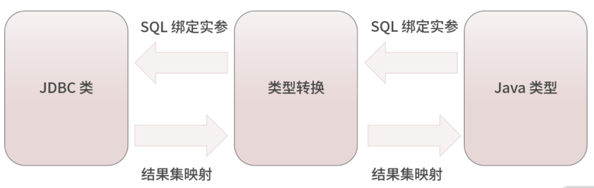

MyBatis-3.5.7 源码阅读
=====================================
Mybatis 三层结构设计：  

## 类型转换模块 
1、可以在 mybatis-config.xml 配置文件中通过 <typeAliase> 标签为一个类定义一个别名，这里用到的 “别名机制” 就是由 MyBatis 基础支撑层中的类型转换模块实现的。     
2、除了“别名机制”，类型转换模块还实现了 MyBatis 中 JDBC 类型与 Java 类型之间的相互转换，这一功能在绑定实参、映射 ResultSet 场景中都有所体现：      
    2.1、在 SQL 模板绑定用户传入实参的场景中，类型转换模块会将 Java 类型数据转换成 JDBC 类型数据。       
    2.2、在将 ResultSet 映射成结果对象的时候，类型转换模块会将 JDBC 类型数据转换成 Java 类型数据。        
    具体情况如图所示：    
    
    
    
    
## 日志
org.apache.ibatis.logging
org.apache.ibatis.logging.commons
org.apache.ibatis.logging.jdbc
org.apache.ibatis.logging.jdk14
org.apache.ibatis.logging.log4j
org.apache.ibatis.logging.log4j2
org.apache.ibatis.logging.nologging
org.apache.ibatis.logging.slf4j
org.apache.ibatis.logging.stdout

* [适配器设计模式](http://www.cnblogs.com/liuling/archive/2013/04/12/adapter.html)

## 异常
org.apache.ibatis.exceptions

## 缓存
org.apache.ibatis.cache
org.apache.ibatis.cache.decorators
org.apache.ibatis.cache.impl

## 4.解析
org.apache.ibatis.parsing
xml解析，${} 格式的字符串解析
源码分析可以参考http://www.cnblogs.com/sunzhenchao/p/3161093.html

## 5.类型处理器
org.apache.ibatis.type
实现java和jdbc中的类型之间转换
源码分析可以参考http://www.cnblogs.com/sunzhenchao/archive/2013/04/09/3009431.html

## 6.IO
org.apache.ibatis.io
通过类加载器在jar包中寻找一个package下满足条件(比如某个接口的子类)的所有类

## 7.反射
org.apache.ibatis.reflection
org.apache.ibatis.reflection.factory
org.apache.ibatis.reflection.invoker
org.apache.ibatis.reflection.property
org.apache.ibatis.reflection.wrapper
可以参考MetaObjectTest来跟踪调试，基本上用到了reflection包下所有的类

## 8.数据源
org.apache.ibatis.datasource
org.apache.ibatis.datasource.jndi
org.apache.ibatis.datasource.pooled
org.apache.ibatis.datasource.unpooled

## 9.事务
org.apache.ibatis.transaction
org.apache.ibatis.transaction.jdbc
org.apache.ibatis.transaction.managed

## 10.会话
org.apache.ibatis.session
org.apache.ibatis.session.defaults

## 11.jdbc单元测试工具
org.apache.ibatis.jdbc

## 12.构建
org.apache.ibatis.builder
org.apache.ibatis.builder.annotation
org.apache.ibatis.builder.xml

## 13.映射
org.apache.ibatis.mapping

## 14.脚本
org.apache.ibatis.scripting
org.apache.ibatis.scripting.defaults
org.apache.ibatis.scripting.xmltags

## 15.注解
org.apache.ibatis.annotations

## 16.绑定
org.apache.ibatis.binding

## 17.执行器
org.apache.ibatis.executor
org.apache.ibatis.executor.keygen
org.apache.ibatis.executor.loader
org.apache.ibatis.executor.loader.cglib
org.apache.ibatis.executor.loader.javassist
org.apache.ibatis.executor.parameter
org.apache.ibatis.executor.result
org.apache.ibatis.executor.resultset
org.apache.ibatis.executor.statement

## 18.插件
org.apache.ibatis.plugin

Essentials
----------

* [See the docs](http://mybatis.github.io/mybatis-3)
* [Download Latest](https://github.com/mybatis/mybatis-3/releases)
